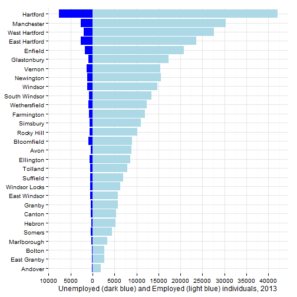
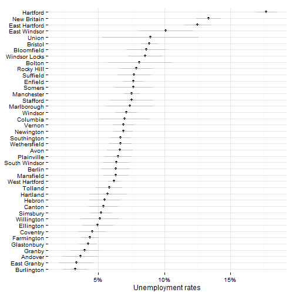

## Unemployment indicators

This section covers indicators related to unemployment and the labor force in the Hartford area. 

## Data and limitations

Data on unemployment comes from DoL and ACS. 

## What do we already know?

Unemployment rates are the single most commonly-used indicator in the reports we reviewed; below are references for some. 

### Local

* [Health Equity Index](http://www.cadh.org/health-equity/health-equity-index.html) 
* [MetroHartford Alliance's Regional Economic Scorecard](http://www.metrohartford.com/economic-development/regional-data) 
* [Opportunities Hartford](http://www.cahs.org/programs-opportunitieshartford.asp) 
* [Pioneer Valley State of the People](http://pvpc.org/resources/datastats/state-of-people/stateofthepeople2013.pdf) 
* [CT Voices for Children](http://www.ctvoices.org/) 

### Other relevant efforts

* [Boston Indicators Project](http://www.bostonindicators.org/) 
* [The Child Well-Being Index](http://fcd-us.org/our-work/child-well-being-index-cwi) * [Chicago Department of Public Health](https://data.cityofchicago.org/Health-Human-Services/hardship-index/792q-4jtu) 
* [The Rhode Island Community Foundation](http://www.rifoundation.org/CommunityLeadership/CommunityDashboard/tabid/1157/Default.aspx) 
* [The American Human Development Index (HDI)](http://www.measureofamerica.org/human-development/) 
* [What Matters to Metros](http://www.futurefundneo.org/whatmatters) 

## Sample results

The sample results are for all towns in Hartford and Tolland Counties since it is easier to extract ACS data that way. 

Unemployment rates from the ACS (2007 - 2011 5-year estimates)

 

Margins of error for the same.

 

Labor force participation rates

 

Margins of error for labor force participation
Why are Somers, Mansfield and Suffield so high? 

 

Unemployment by neighborhood 

 

Labor force participation by neighborhood

 

Then get DoL data

Look at table S2301 for data on labor force participation - old and young

