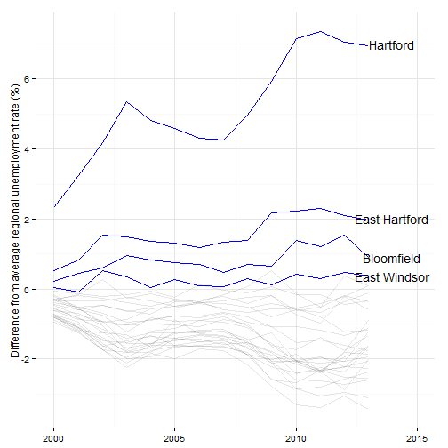
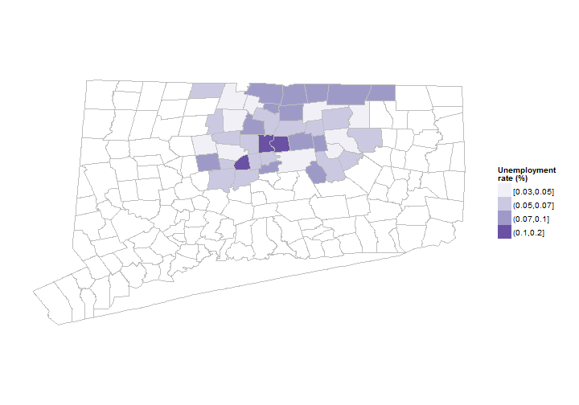
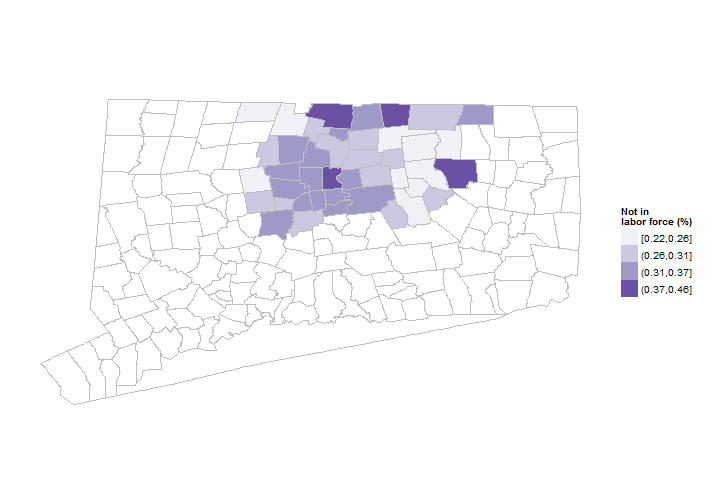
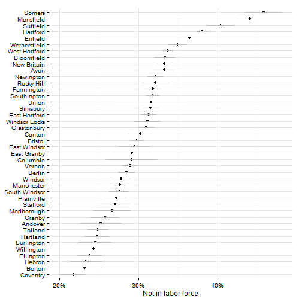
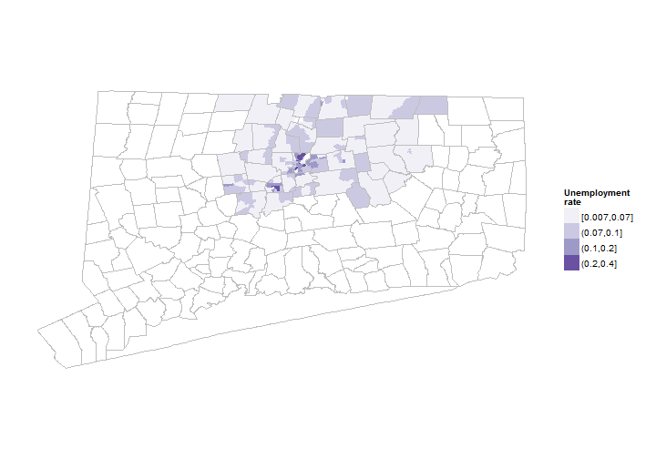
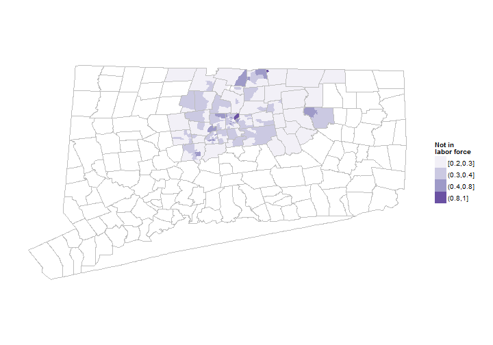
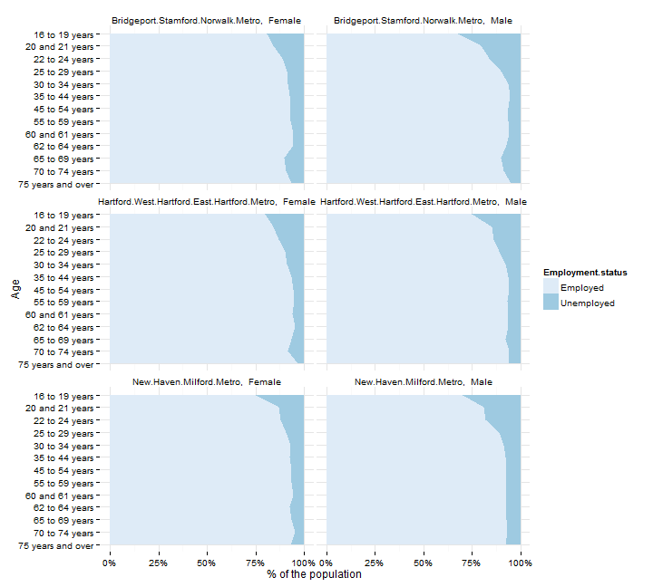

## Unemployment indicators

This section covers indicators related to unemployment and the labor force in the Hartford area. 

## Data and limitations

Data on unemployment comes from two sources: 
* The Bureau of Labor Statistics (BLS), which is then provided locally by the Connecticut Department of Labor (DoL). 
* The U.S. Census Bureau, primarily through the American Community Survey (ACS).

The data from the BLS is more frequent - with monthly updates - and available by town, but it lacks much of the demographic information at the local level. 

The ACS data is less frequent - on a 3 - 5 year cycle for most towns in the region - but it contains more information on demographics (age, gender, race / ethnicity) and on labor force participation. 

Data from both sources is reviewed below for the Hartford region. 

## What do we already know?

Unemployment rates are the single most commonly-used indicator in the reports we reviewed; below are references for some. 

### Local

* [CETC Report Card](http://www.ctdol.state.ct.us/OWC/CETC/2013ReportCard.pdf) included the unemployment rate as a key indicator for the state. 
* [CT Fair Housing Center Opportunity Mapping](http://www.ctfairhousing.org/people-place-and-opportunity-report/) (developed with the Kirwan Institute at Ohio State) includes local unemployment levels, using Census data. 
* [CWP Community Workforce Development Report Card](http://www.capitalworkforce.org/ctworks/documents/Community_Workforce_Development_Report_Card_2011ff.pdf) include unemployment rates from the BLS and CT Department of Labor. 
* [CT Kids Report Card](http://www.cga.ct.gov/kid/rba/results.asp) includes parents with full-time employment as an indicator, using Census data. 
* [Health Equity Index](http://www.cadh.org/health-equity/health-equity-index.html) includes the neighborhood-level unemployment data (for the civilian labor force) as one factor.
* [MetroHartford Alliance's Regional Economic Scorecard](http://www.metrohartford.com/economic-development/regional-data) included the unemployment rate from the CT Department of Labor (via BLS).
* [Opportunities Hartford](http://www.cahs.org/programs-opportunitieshartford.asp) looks at unemployment rates for the labor force (U3 rate), and the labor force plus discouraged workers (U6 rate). 
* [Pioneer Valley State of the People](http://pvpc.org/resources/datastats/state-of-people/stateofthepeople2013.pdf) includes unemployment rate under 'Economic Security.'
* [Population Results Working Group](http://www.ct.gov/opm/cwp/view.asp?a=2998&Q=490946) includes rates of long-term unemployment from the CT Department of Labor as well as youth (16 - 24 year old) unemployment rates from the Census. 
* [Sustainable Knowledge Corridor Dashboard](http://www.sustainableknowledgecorridor.org/site/content/how-are-we-doing) includes the BLS / CT DoL unemployment rates. 
* [Data Haven's Community Well-Being Index](http://www.ctdatahaven.org/communityindex) includes the unemployment rate as one factor in their index. 

### Other relevant efforts

* [Boston Indicators Project](http://www.bostonindicators.org/) includes the neighborhood unemployment rate from the ACS, and also employment levels by sector from state agencies. 
* [The Child Well-Being Index](http://fcd-us.org/our-work/child-well-being-index-cwi) includes the unemployment rate for parents, from the ACS, as a factor. 
* [Chicago Department of Public Health](https://data.cityofchicago.org/Health-Human-Services/hardship-index/792q-4jtu) includes the unemployment rate by neighborhood (from the Census) as a hardship factor.
* [The Rhode Island Community Foundation](http://www.rifoundation.org/CommunityLeadership/CommunityDashboard/tabid/1157/Default.aspx) includes the unemployment rate as background on Rhode Islan. 
* [The American Human Development Index (HDI)](http://www.measureofamerica.org/human-development/) 
* [What Matters to Metros](http://www.futurefundneo.org/whatmatters) includes the unemployment rate and the labor force participation rate from the BLS by metro area. 

## Sample results

The BLS / CT DoL produce town-level unemployment data by month. Trends for the region shows a lot of fluctuation by month, but consistency overall in the general trend across towns, which also track national employment trends. 

 

Annualized unemployment rates are much smoother, but with the same general trend. 

 

Since trends are similar for most towns in the region, it can help to look for gaps between towns. 

The graph below compares each town to the average unemployment rate in the region since 200. Four towns - Hartford, East Hartford, Bloomfield and East Windsor - have had above-average unemployment rates within the region for the past decade. 

 

The BLS data also estimates the number of individuals in the labor force, employed and unemployed, to give a sense of how many people are affected in the region. 

Hartford has the largest labor force, followed by Manchester, West Hartford and East Hartford.  

 

The second data source for unemployment is the American Community Survey. For individual towns in the region, 5-year estimates are required, currently covering 2007 - 2011. Unemployment rates are mapped below for Hartford and Tolland counties.  

 

As with other ACS data, small towns have higher margins of error - meaning we can't actually say whether Bolton has a higher or lower unemployment rate than Windsor Locks using this data set. Hartford, East Hartford and East Windsor all have clearly higher than average rates, although Bloomfield appears better off than with the BLS data.

 

The ACS data also provides estimates of labor force participation for the population. Anyone not actively seeking work (or discouraged workers) is excluded from the labor force. 

The percent of the population not in the labor force (not actively seeking work or employed) is mapped below. 

 

There are again high margins of error for small towns. In addition, the ACS includes the population living in 'group quarters,' so estimates for towns like Somers or Mansfield include dormitories and the prison population. 

For the larger towns in the region, Hartford has the highest percentage (38%) not in the labor force. 

 

The ACS data can be taken to a neighborhood level using the 2007 - 2011 5-year estimates. Unemployment rates are mapped below for the region by census tract. 

High unemployment rates are clustered in the same towns as seen earlier, although some new areas - like in Manchester - appear that are masked with the town level data. 

 

Labor force participation can also be mapped by neighborhood, which helps to isolate small pockets with low participation (as in Mansfield and Somers). 

 

The ACS provides many additional demographic breakouts. The chart below looks at Connecticut's three largest metro areas, with 5-year census estimates  for [civilians in the labor force](http://factfinder2.census.gov/faces/tableservices/jsf/pages/productview.xhtml?pid=ACS_11_5YR_B23001&prodType=table).

Unemployment rates are highest for young males within the region, similar to other parts of Connecticut.

 

